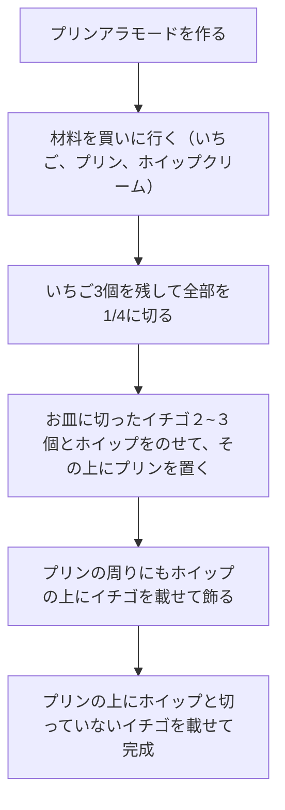

```mermaid
graph TD;
Todo[プリンアラモードを作る]
shopping[材料を買いに行く（いちご、プリン、ホイップクリーム）];
first[いちご3個を残して全部を1/4に切る];
second[お皿に切ったイチゴ２~３個とホイップをのせて、その上にプリンを置く];
third[プリンの周りにもホイップの上にイチゴを載せて飾る];
forth[プリンの上にホイップと切っていないイチゴを載せて完成];
Todo-->shopping;
shopping-->first;
first-->second;
second-->third;
third-->forth;
```