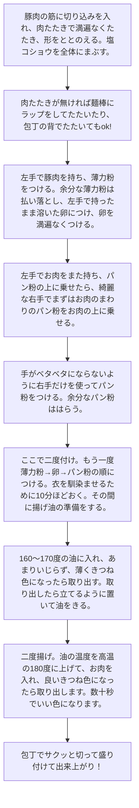

## とんかつの調理工程
引用元☆ : [クックパッド　簡単なコツでサクサクに仕上がるとんかつ](https://cookpad.com/recipe/3105823)
### 材料
1. とんかつ用豚肉 2枚
2. 塩 少々
3. こしょう 少々
4. 薄力粉 適量
5. 卵 1個
6. パン粉 適量
7. サラダ油 適量

```mermaid
flowchart TB
A[豚肉の筋に切り込みを入れ、肉たたきで満遍なくたたき、形をととのえる。塩コショウを全体にまぶす。] --> B[肉たたきが無ければ麺棒にラップをしてたたいたり、包丁の背でたたいてもok!]
B --> C[左手で豚肉を持ち、薄力粉をつける。余分な薄力粉は払い落とし、左手で持ったまま溶いた卵につけ、卵を満遍なくつける。]
C --> D[左手でお肉をまた持ち、パン粉の上に乗せたら、綺麗な右手でまずはお肉のまわりのパン粉をお肉の上に乗せる。]
D --> E[手がベタベタにならないように右手だけを使ってパン粉をつける。余分なパン粉ははらう。]
E --> F[ここで二度付け。もう一度薄力粉→卵→パン粉の順につける。衣を馴染ませるために10分ほどおく。その間に揚げ油の準備をする。]
F --> G[160〜170度の油に入れ、あまりいじらず、薄くきつね色になったら取り出す。取り出したら立てるように置いて油をきる。]
G --> H[二度揚げ。油の温度を高温の180度に上げて、お肉を入れ、良いきつね色になったら取り出します。数十秒でいい色になります。]
H --> R[包丁でサクッと切って盛り付けて出来上がり！]
```