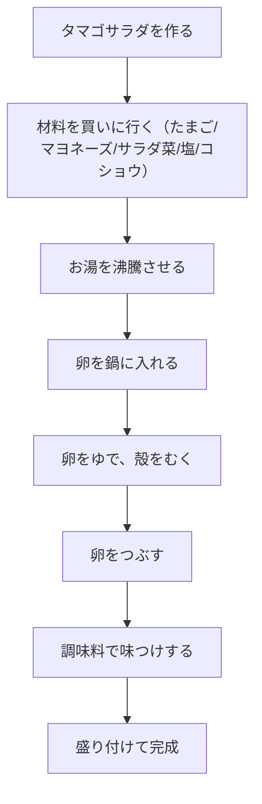

## タマゴサラダの調理工程
引用元 : [タマゴサラダの基本レシピ](https://www.kewpie.co.jp/recipes/basicsalad/salad11/)
### 材料
1. 卵　３個
2. マヨネーズ　大さじ4
3. サラダ菜　2枚
4. 塩　少々
5. 胡椒　少々

```mermaid
graph TD;
Todo[タマゴサラダを作る]
shopping[材料を買いに行く（たまご/マヨネーズ/サラダ菜/塩/コショウ）];
first[お湯を沸騰させる];
second[卵を鍋に入れる];
third[卵をゆで、殻をむく];
forth[卵をつぶす];
fifth[調味料で味つけする];
sixth[盛り付けて完成]
Todo-->shopping;
shopping-->first;
first-->second;
second-->third;
third-->forth;
forth-->fifth
fifth-->sixth
```
