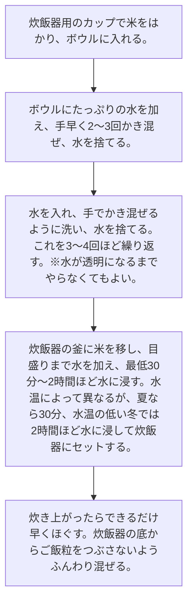

## 米を炊く

引用元☆ : [ご飯の炊き方](https://park.ajinomoto.co.jp/recipe/basic/cookrice/)  

```mermaid
flowchart TB
A[炊飯器用のカップで米をはかり、ボウルに入れる。] --> B[ボウルにたっぷりの水を加え、手早く2～3回かき混ぜ、水を捨てる。]
B --> C[水を入れ、手でかき混ぜるように洗い、水を捨てる。これを3～4回ほど繰り返す。※水が透明になるまでやらなくてもよい。]
C --> D[炊飯器の釜に米を移し、目盛りまで水を加え、最低30分～2時間ほど水に浸す。水温によって異なるが、夏なら30分、水温の低い冬では2時間ほど水に浸して炊飯器にセットする。]
D --> E[炊き上がったらできるだけ早くほぐす。炊飯器の底からご飯粒をつぶさないようふんわり混ぜる。]
```
